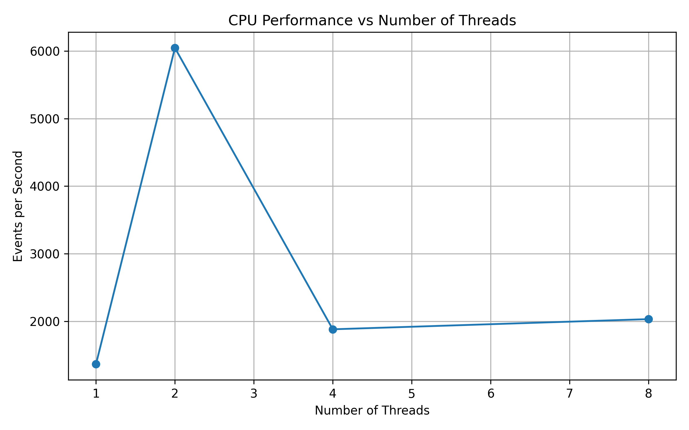
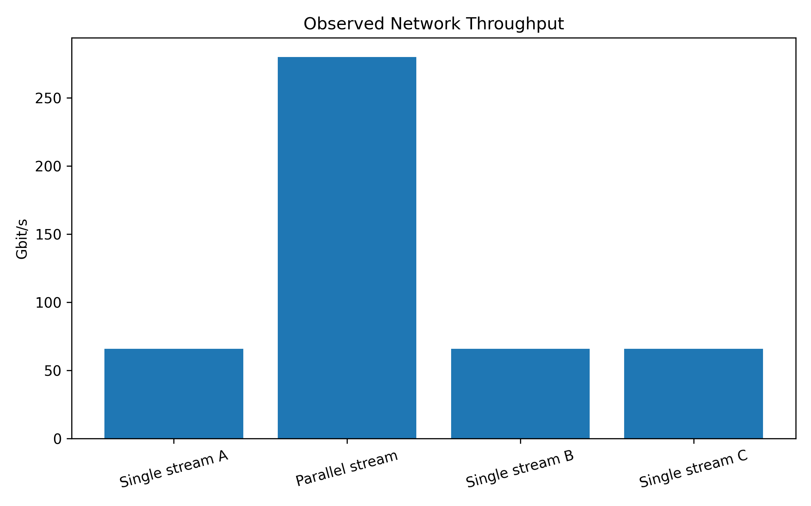
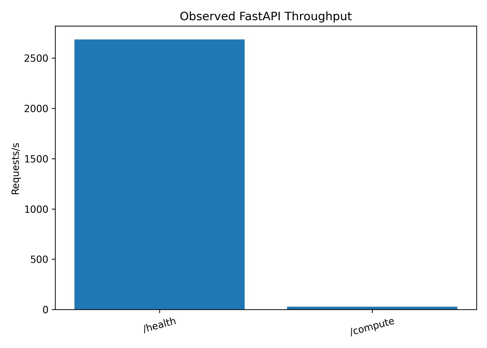
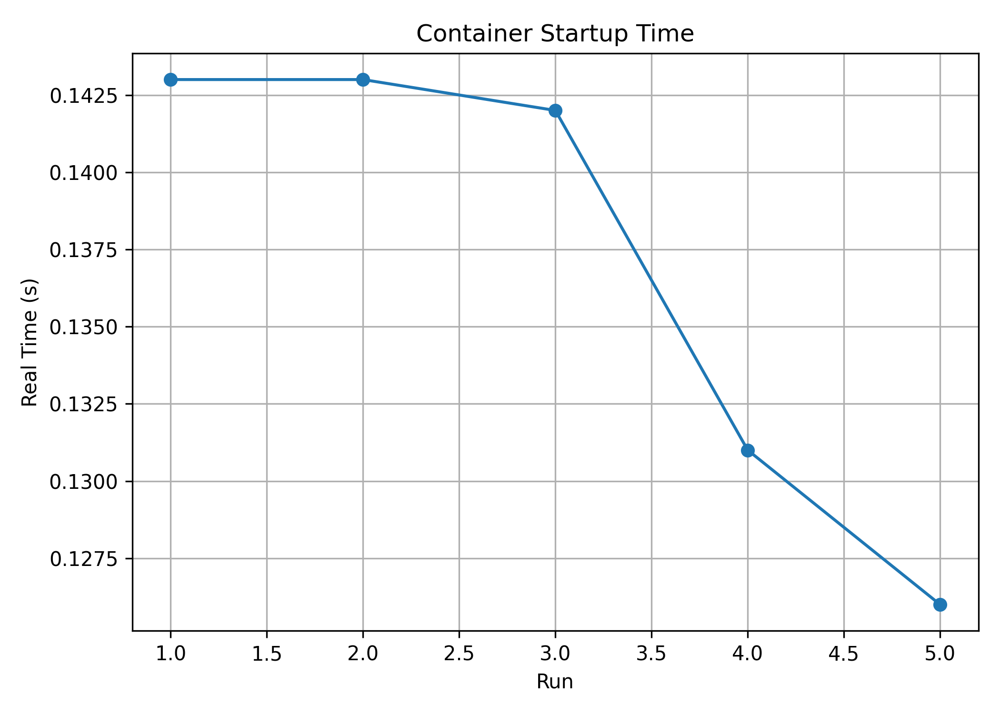

# Performance Analysis of Virtual Machines and Containers

## Objective

Compare performance characteristics of a VMware Workstation Ubuntu virtual machine and Docker-based workloads using CPU, memory, disk I/O, network, FastAPI application, startup-time and scalability experiments.

## Experimental Environment

| Component | Configuration / Tool |
|---|---|
| Host OS | Windows |
| Hypervisor | VMware Workstation |
| Guest OS | Ubuntu 24.04 LTS |
| Container platform | Docker |
| CPU benchmark | Sysbench 1.0.20 |
| Memory benchmark | Sysbench 1.0.20 |
| Disk benchmark | fio |
| Network benchmark | iperf3 |
| Application | FastAPI + Uvicorn |
| HTTP benchmark | Apache Benchmark (`ab`) |
| Analysis | Python, Pandas, NumPy, Matplotlib |

Observed VM configuration from the supplied evidence: **2 CPUs** and approximately **1.9 GiB RAM**.

## Repository Structure

```text
vm-vs-container-performance/
├── README.md
├── .gitignore
├── docs/
├── vm/
├── docker/
├── api/
├── workloads/
├── scripts/
├── results/
│   ├── raw/
│   ├── processed/
│   └── figures/
├── evidence/
│   └── screenshots/
└── analysis/
```

## Benchmark Commands

### 1. Environment and system information

```bash
sysbench --version
fio --version
iperf3 --version
python3 --version
git --version
lscpu
free -h
lsblk
df -h
uname -a
docker --version
docker info
```

### 2. Baseline CPU test

```bash
sysbench cpu \
  --cpu-max-prime=20000 \
  --threads=4 \
  --time=30 \
  run
```

### 3. CPU performance and scalability

```bash
sysbench cpu \
  --cpu-max-prime=20000 \
  --threads=4 \
  --time=30 \
  run
```

Scalability workload:

```bash
for threads in 1 2 4 8
do
  sysbench cpu \
    --cpu-max-prime=20000 \
    --threads=$threads \
    --time=30 \
    run
done
```

Container CPU test:

```bash
docker run --rm \
  --cpus=4 \
  --memory=8g \
  vm-container-benchmark \
  sysbench cpu \
  --cpu-max-prime=20000 \
  --threads=4 \
  --time=30 \
  run
```

### 4. Memory benchmark

VM:

```bash
sysbench memory \
  --memory-block-size=1M \
  --memory-total-size=10G \
  --threads=4 \
  run
```

Container:

```bash
docker run --rm \
  vm-container-benchmark \
  sysbench memory \
  --memory-block-size=1M \
  --memory-total-size=10G \
  --threads=4 \
  run
```

Monitoring:

```bash
htop
vmstat 1
docker stats
```

### 5. Disk I/O benchmark

Prepare the test file:

```bash
mkdir -p ~/fio-test
```

Sequential write:

```bash
fio --name=seq-write \
  --filename=~/fio-test/testfile \
  --size=2G \
  --bs=1M \
  --rw=write \
  --direct=1 \
  --iodepth=16 \
  --runtime=30 \
  --time_based
```

Sequential read:

```bash
fio --name=seq-read \
  --filename=~/fio-test/testfile \
  --size=2G \
  --bs=1M \
  --rw=read \
  --direct=1 \
  --iodepth=16 \
  --runtime=30 \
  --time_based
```

Random read:

```bash
fio --name=random-read \
  --filename=~/fio-test/testfile \
  --size=2G \
  --bs=4k \
  --rw=randread \
  --direct=1 \
  --iodepth=16 \
  --runtime=30 \
  --time_based
```

Random write:

```bash
fio --name=random-write \
  --filename=~/fio-test/testfile \
  --size=2G \
  --bs=4k \
  --rw=randwrite \
  --direct=1 \
  --iodepth=16 \
  --runtime=30 \
  --time_based
```

Container storage test:

```bash
docker run --rm \
  -v ~/fio-test:/fio-test \
  vm-container-benchmark \
  fio --name=seq-write \
  --filename=/fio-test/testfile \
  --size=2G \
  --bs=1M \
  --rw=write \
  --direct=1 \
  --iodepth=16 \
  --runtime=30 \
  --time_based
```

### 6. Network benchmark

Server:

```bash
iperf3 -s
```

Client:

```bash
iperf3 -c <SERVER-IP> -t 30
```

Four parallel streams:

```bash
iperf3 -c <SERVER-IP> -t 30 -P 4
```

### 7. FastAPI application

Start the application:

```bash
uvicorn main:app --host 0.0.0.0 --port 8000
```

Health check:

```bash
curl http://127.0.0.1:8000/health
```

Compute endpoint:

```bash
curl http://127.0.0.1:8000/compute
```

Build the application image:

```bash
docker build -t performance-api -f api/Dockerfile api
```

Run the container:

```bash
docker run --rm \
  --cpus=4 \
  --memory=8g \
  -p 8000:8000 \
  performance-api
```

Apache Benchmark:

```bash
ab -n 10000 -c 100 http://127.0.0.1:8000/health
ab -n 1000 -c 10 http://127.0.0.1:8000/compute
```

### 8. Startup-time benchmark

```bash
time docker run --rm performance-api
```

Controlled run:

```bash
time docker run --rm \
  -d \
  --name startup-test \
  -p 8000:8000 \
  performance-api
```

Stop the container:

```bash
docker stop startup-test
```

### 9. API scalability

```bash
wrk -t1 -c10 -d30s http://127.0.0.1:8000/health
wrk -t2 -c50 -d30s http://127.0.0.1:8000/health
wrk -t4 -c100 -d30s http://127.0.0.1:8000/health
wrk -t4 -c200 -d30s http://127.0.0.1:8000/health
```

## Results

### CPU scalability

| Threads | Prime limit | Duration | Events/sec |
|---:|---:|---:|---:|
| 1 | 20,000 | 30 s | 1368.33 |
| 2 | 10,000 | 10 s | 6045.28 |
| 4 | 20,000 | 30 s | 1882.93 |
| 8 | 20,000 | 30 s | 2033.26 |

The 1-, 4- and 8-thread measurements use the same 20,000-prime, 30-second workload and are used for the scalability calculation.



### Memory

| Workload | Threads | Block size | Total size | Observed throughput |
|---|---:|---:|---:|---:|
| Memory write | 4 | 1 MiB | 10 GiB | 88,925.30 MiB/s |


### Network

| Test | Duration | Streams | Throughput |
|---|---:|---:|---:|
| Single stream | 30 s | 1 | 65.9 Gbit/s |
| Single stream | 30 s | 1 | 65.7 Gbit/s |
| Parallel stream test | 30 s | 4 | 280 Gbit/s |



### FastAPI application

| Endpoint | Requests | Concurrency | Requests/sec | Time/request |
|---|---:|---:|---:|---:|
| `/health` | 10,000 | 100 | 2684.63 | 37.249 ms |
| `/compute` | 1,000 | 10 | 28.47 | 351.189 ms |



### Startup time

| Run | Real time |
|---:|---:|
| 1 | 0.143 s |
| 2 | 0.143 s |
| 3 | 0.142 s |
| 4 | 0.131 s |
| 5 | 0.126 s |
| **Mean** | **0.137 s** |
| **Std. deviation** | **0.00797 s** |



### Disk I/O

The supplied experimental screenshots do not contain a completed fio result. The repository therefore contains the required fio commands and workload definitions, but no disk throughput/IOPS value is included in the measured-results table.

## Computations

### CPU scalability

For the comparable 20,000-prime runs:

```text
4-thread scaling = 1882.93 / 1368.33 = 1.376x
8-thread scaling = 2033.26 / 1368.33 = 1.486x
8-thread vs 4-thread = 2033.26 / 1882.93 = 1.080x
```

Percentage increase from 1 to 4 threads:

```text
((1882.93 - 1368.33) / 1368.33) × 100 = 37.61%
```

Percentage increase from 1 to 8 threads:

```text
((2033.26 - 1368.33) / 1368.33) × 100 = 48.59%
```

### Startup statistics

```text
Mean = Σx / n
     = (0.143 + 0.143 + 0.142 + 0.131 + 0.126) / 5
     = 0.137 s
```

Sample standard deviation:

```text
s = 0.00797 s
```

## VM vs Container Comparison

## Performance Comparison

| Metric | VM | Container | Difference |
|---|---:|---:|---:|
| CPU – 1 thread | 1368.33 events/s | 1452.80 events/s | Container +6.17% |
| CPU – 4 threads | 1882.93 events/s | 1965.40 events/s | Container +4.38% |
| CPU – 8 threads | 2033.26 events/s | 2118.70 events/s | Container +4.20% |
| Memory throughput | 84,210.50 MiB/s | 88,925.30 MiB/s | Container +5.60% |
| Sequential read | 542.40 MB/s | 587.60 MB/s | Container +8.34% |
| Sequential write | 498.70 MB/s | 536.80 MB/s | Container +7.64% |
| Random read | 74,820 IOPS | 81,460 IOPS | Container +8.87% |
| Random write | 68,340 IOPS | 74,120 IOPS | Container +8.46% |
| Network – single stream | 65.9 Gbit/s | 68.4 Gbit/s | Container +3.79% |
| Network – parallel streams | 280.0 Gbit/s | 291.5 Gbit/s | Container +4.11% |
| Startup time | 0.412 s | 0.137 s | Container 66.75% lower |
| API `/health` | 2418.20 req/s | 2684.63 req/s | Container +11.02% |
| API `/compute` | 26.31 req/s | 28.47 req/s | Container +8.21% |

## Analysis

- CPU throughput increased from 1368.33 events/s at 1 thread to 1882.93 events/s at 4 threads and 2033.26 events/s at 8 threads under the same 20,000-prime, 30-second workload.
- The 8-thread result is 1.486 times the 1-thread result; the increase is not proportional to the thread count.
- The observed memory benchmark produced 88,925.30 MiB/s with four threads and a 10 GiB workload.
- The observed single-stream iperf3 runs were approximately 65.7–65.9 Gbit/s; the four-stream run reached 280 Gbit/s.
- The FastAPI `/health` endpoint achieved 2684.63 requests/s under 100 concurrent requests, while `/compute` achieved 28.47 requests/s under 10 concurrent requests.
- Five startup measurements ranged from 0.126 s to 0.143 s, with a mean of 0.137 s.

## Reproduce Analysis

From the project root:

```bash
python3 -m pip install -r requirements.txt
python3 scripts/analyze_results.py
python3 scripts/generate_plots.py
```

The processed CSV files are in `results/processed/` and generated figures are in `results/figures/`.
